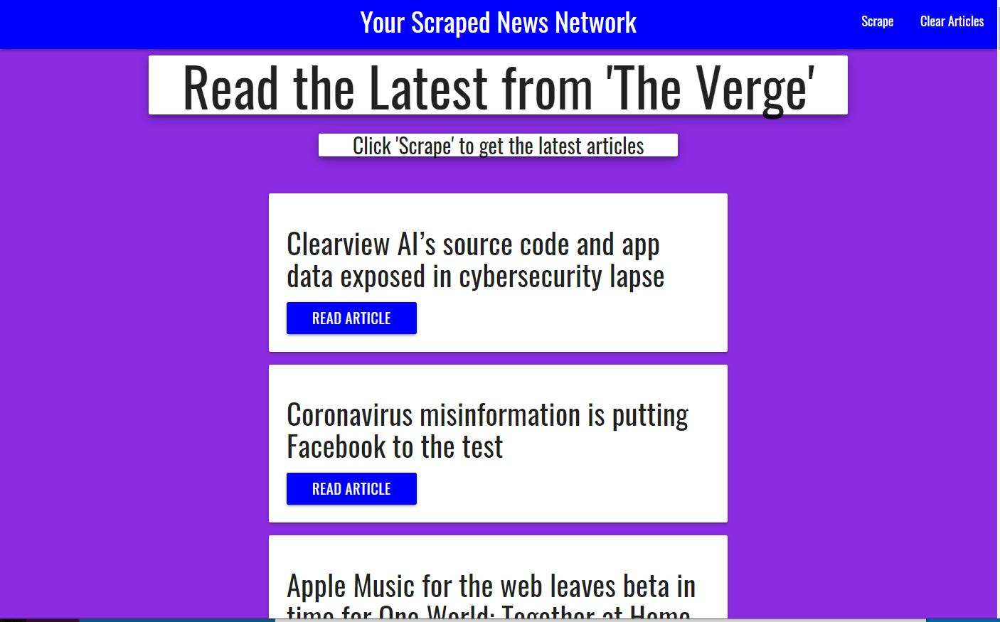

News Scraper
Full Stack website that scrapes headlines from The Verge
Description
This full stack web site scrapes story headlines from the Verge and allows for user comments to be added/removed to each story. Headlines, summary, link and comments are stored in a mongo database.

Front-End Technology
HTML, CSS, JavaScript , jQuery, Bootstrap, Handlebars
Back-End Technology
Node.js, Express.js, mongo.js, mongoose ORM, JavaScript, NPM packages (axios, cheerio,express, mongoose, morgan), Heroku
Details:
Github project : News Scraper Repository
Deployed Heroku link: News Scraper

Here is a link to the deployed heroku site:

https://thawing-ridge-21750.herokuapp.com/readArticle/5e9cb56b4e15ec001783af18

